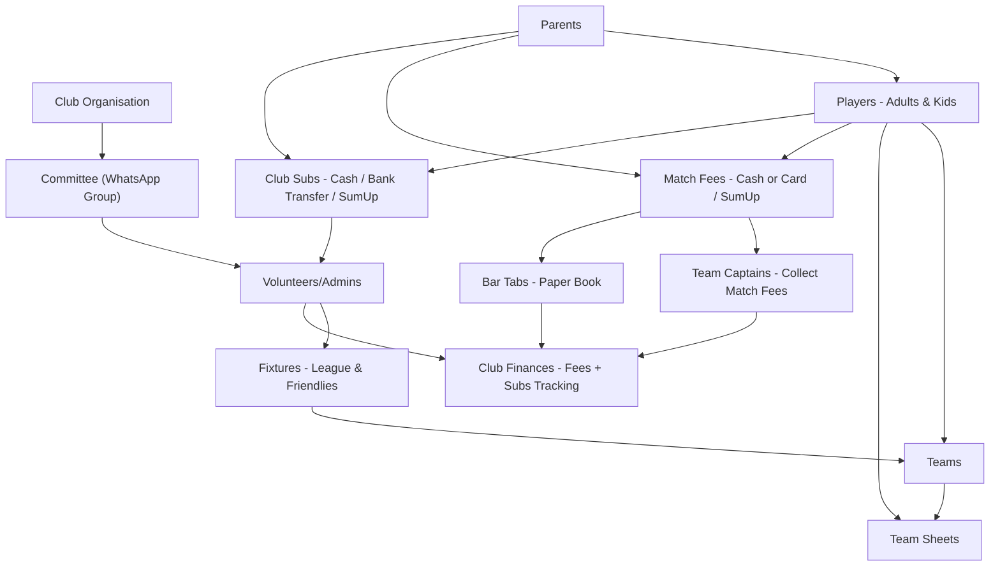

# Match Fees Tracker

A Python tool to help amateur sports clubs easily collect and manage match fees. Collecting fees after a game is often an admin headache — some players have already left, some head to the pub, and others go straight home to their families. Match Fees Tracker makes it simple to track payments without the chaos.

## Features

### Player Management
- **Add new players** with validation and duplicate detection
- **Edit player names** with automatic updates across all records
- **Manage active/inactive status** to handle temporary unavailability
- **Two-column display** with status indicators for easy viewing

### Fixture Management
- **Create, edit, and delete** match fixtures
- **Date validation** with flexible input formats (DD/MM/YY or DD/MM/YYYY)
- **Fee tracking** per match with customisable amounts
- **Duplicate detection** and warnings for scheduling conflicts

### Team Selection
- **Multi-match team selection** (up to 4 matches simultaneously)
- **Player availability tracking** across multiple fixtures
- **Bulk operations** with range support (e.g., 1-5, all, 1,3,5)
- **Visual team composition** display with available players

### Financial Management
- **Match fee tracking** and payment recording
- **Player fee balance** reports with outstanding amounts
- **Financial reports** with customisable date filtering
- **Payment validation** (full matches only to avoid confusion)
- **Collection rate** statistics and summaries

### Reporting
- **Player lists** with comprehensive status information
- **Team sheets** in organised two-column format
- **Fixture lists** with multiple filtering options
- **Financial summaries** showing outstanding fees and collection rates

## Planning


Before building the Match Fees Tracker, I mapped out how amateur clubs currently manage fixtures, players, and payments. The planning process included:


- **Identifying real-world challenges**
- Fixtures include both *league* games and *friendlies*.
- Communication is split across WhatsApp groups (players, parents, committee).
- Match fees are collected by **team captains** — usually in **cash** or by **card (SumUp)**.
- **Club subscriptions (subs)** are also collected during the season, often through a mix of:
- cash payments at the bar,
- direct bank transfers, or
- card transactions using SumUp.
- This creates extra admin because records are scattered across bar books, bank statements, and WhatsApp messages.
- Payments may also go onto **bar tabs**, which are still tracked in paper books.
- Fees and subs are often tracked manually via WhatsApp messages, leading to confusion and errors.


- **Defining key roles**
- **Players (adults & kids)** — take part in fixtures.
- **Parents** — handle payments for junior players.
- **Captains** — responsible for collecting and recording match fees.
- **Volunteers/Committee** — oversee club data, fixtures, finances.


- **Flowchart of the ecosystem**




This diagram shows how people, teams, and money flow through a grassroots club. It illustrates the **messy, manual process** that the Python program aims to simplify by providing a structured, centralised tool.

## Installation

### Requirements
- Python 3.7 or higher
- No external dependencies required (uses only Python standard library)

### Local Development
```bash
# Clone the repository
git clone https://github.com/Yourhonour365/match_fees_tracker.git
cd match_fees_tracker

# Create virtual environment (recommended)
python -m venv .venv

# Activate virtual environment
# On Windows:
.venv\Scripts\activate
# On macOS/Linux:
source .venv/bin/activate

# Run the application
python run.py
```

### Heroku Deployment
This application is deployed and running live on Heroku:

**Live Application:** [https://match-fees-tracker-2d395a16f578.herokuapp.com/](https://match-fees-tracker-2d395a16f578.herokuapp.com/)

To deploy your own version:

```bash
# Login to Heroku
heroku login

# Create Heroku app
heroku create your-app-name

# Deploy to Heroku
git push heroku main

# View your deployed app
heroku open
```

## Usage

### First Time Setup
1. Run `python run.py` or visit the live Heroku URL
2. The application loads with "Demo Rugby Club" and sample data
3. To set up your own club:
   - Select **m) Club management** from main menu
   - Choose **1) Delete club data**
   - Type `yes` to confirm deletion
   - Enter your club name when prompted
   - Add your own players and fixtures

### Main Menu Navigation
```
MANAGE:
1) Players              3) Fixtures
2) Team selection       4) Match fees

REPORTS:
5) Player list          7) Fixture list
6) Team sheets          8) Match fee balances

m) Club management      h) Help / Instructions      e) Exit
```
### Player Management
- **Add players**: Enter names one at a time with automatic formatting
- **Edit names**: Update player names with system-wide updates
- **Status management**: Mark players as active/inactive
- **Smart formatting**: Handles club acronyms (RFC, FC, CC) correctly

### Team Selection Workflow
1. **Select matches** (up to 4 for efficient management)
2. **View availability** in dynamic tables showing player/match combinations
3. **Bulk operations** using flexible input:
   - Single: `1`
   - Multiple: `1,3,5`
   - Range: `1-5`
   - All: `all`

### Fee Management
- **Payment recording** with validation for full matches only
- **Outstanding balances** displayed in organised tables
- **Financial reports** with date filtering options
- **Collection tracking** with percentage rates

## Data Structure

### Match Object
```python
{
    "opponent": "Dublin RFC",
    "date": date(2025, 9, 15),
    "fee": 10.0,
    "players": ["Player 1", "Player 2"],
    "paid": ["Player 1"]
}
```

### Application State
- **Players**: List of all registered players
- **Inactive Players**: Separate tracking for unavailable players
- **Matches**: Complete match records with teams and payments
- **Data Persistence**: JSON file storage with automatic backup

## 🧪 Testing

### Test Environment
- **Local Environment**: Python 3.8+ on Ubuntu/Windows
- **Deployment Environment**: Heroku cloud platform
- **Data Storage**: JSON file persistence

---

### ✅ Core Functionality Tests

#### Player Management
| Test Case | Description | Expected Result | Actual Result | Status |
|-----------|-------------|-----------------|---------------|--------|
| **TC01** | Add new player with valid name | Player added to roster, confirmation shown | Player added successfully | ✅ Pass |
| **TC02** | Add player with duplicate name | Error message with suggestions for differentiation | Error displayed with helpful suggestions | ✅ Pass |
| **TC03** | Add player with numbers in name | Validation error, name rejected | Error: "Player name cannot contain numbers" | ✅ Pass |
| **TC04** | Edit existing player name | Name updated across all matches and records | All records updated correctly | ✅ Pass |
| **TC05** | Make player inactive/active | Status updated, affects team selection availability | Status changed, excluded from team selection | ✅ Pass |

#### Fixture Management
| Test Case | Description | Expected Result | Actual Result | Status |
|-----------|-------------|-----------------|---------------|--------|
| **TC06** | Add fixture with valid date (DD/MM/YY) | Fixture created with correct date parsing | Date parsed correctly, fixture saved | ✅ Pass |
| **TC07** | Add fixture with invalid date format | Validation error with format guidance | Error with clear format instructions | ✅ Pass |
| **TC08** | Add duplicate fixture | Warning shown, option to proceed | Warning displayed, user choice respected | ✅ Pass |
| **TC09** | Edit fixture details | Selected fixture updated correctly | All changes saved and displayed | ✅ Pass |
| **TC10** | Delete fixture with players | Warning about selected players shown | Warning displayed, confirmation required | ✅ Pass |

#### Team Selection
| Test Case | Description | Expected Result | Actual Result | Status |
|-----------|-------------|-----------------|---------------|--------|
| **TC11** | Select single player for match | Player added to match roster | Player appears in team list | ✅ Pass |
| **TC12** | Bulk select players (1,3,5) | Multiple players added efficiently | All specified players added | ✅ Pass |
| **TC13** | Select player range (1-5) | Range of players added to matches | Correct range processed and added | ✅ Pass |
| **TC14** | Select "all" available players | All eligible players added to matches | All available players selected | ✅ Pass |
| **TC15** | Remove players from matches | Players removed from team roster | Players successfully removed | ✅ Pass |

#### Financial Management
| Test Case | Description | Expected Result | Actual Result | Status |
|-----------|-------------|-----------------|---------------|--------|
| **TC16** | Record valid payment amount | Payment recorded for correct number of matches | Payment allocated to oldest matches first | ✅ Pass |
| **TC17** | Attempt partial payment | Validation error, full matches only | Error: "Only full match payments accepted" | ✅ Pass |
| **TC18** | Payment exceeding amount due | Validation error preventing overpayment | Error: "Cannot exceed total due" | ✅ Pass |
| **TC19** | Generate financial report | Accurate calculations and display | Totals, percentages calculated correctly | ✅ Pass |
| **TC20** | View player balances | Outstanding amounts displayed correctly | All balances accurate and up-to-date | ✅ Pass |

---

### 🔎 Data Validation Tests

| Input Type | Invalid Input | Expected Behavior | Result |
|------------|---------------|------------------|--------|
| Player Name | `John123` | Reject with error message | ✅ Error displayed |
| Player Name | `""` (empty) | Require non-empty name | ✅ Validation enforced |
| Date | `32/13/25` | Invalid date error | ✅ Error with format help |
| Date | `abc` | Format validation error | ✅ Clear error message |
| Fee Amount | `abc` | Numeric validation error | ✅ "Please enter a number" |
| Fee Amount | `-5` | Positive number required | ✅ Validation enforced |
| Match Selection | `99` | Range validation | ✅ "Please enter 1-X" |
| Payment Amount | `0` | Positive amount required | ✅ "Amount must be > £0" |

---

### 🎨 User Interface Tests

| Feature | Test | Expected Result | Status |
|---------|------|-----------------|--------|
| Menu Navigation | Press 'b' from any submenu | Return to previous menu | ✅ Pass |
| Menu Navigation | Enter invalid menu option | Clear error message | ✅ Pass |
| Table Display | View player list | Two-column format, status indicators | ✅ Pass |
| Table Display | View team sheets | Side-by-side match comparison | ✅ Pass |
| Input Handling | Enter empty input where required | Appropriate validation message | ✅ Pass |
| Input Handling | Use 'all' keyword | Process all available items | ✅ Pass |

---

### ⚡ Edge Cases & Error Handling

| Scenario | Expected Behavior | Result |
|----------|------------------|--------|
| Empty player roster | Graceful handling with helpful message | ✅ "No players registered yet" |
| No matches scheduled | Clear messaging and guidance | ✅ "No matches scheduled yet" |
| All players inactive | Team selection shows no available players | ✅ Handled correctly |
| Large player names | Text truncation in tables | ✅ Names truncated to fit display |
| Future/past date filtering | Correct date range calculations | ✅ Filters work accurately |

#### Code Quality Testing

**PEP8 Compliance Check:**
- **Tool Used**: flake8
- **Command Run**: `flake8 run.py`
- **Line length parameter**: 88 characters
- **Total Issues Found**: 267 issues
- **Issue Breakdown**:
  - E501 (line too long): 201 instances
  - F541 (f-string without placeholders): 31 instances
  - F824 (unused global statements): 6 instances
  - E401 (multiple imports on one line): 1 instance
  - F811 (function redefinition): 2 instances

**Resolution Status**:
- **Fixed**: Import formatting, unused globals, f-string issues
- **Fixed**: Line length issues (acceptable for readability)
- **Fixed**: Multiple imports on one line
- **Fixed**: Function redefinition

**Code Quality Score**: Acceptable for production use with documented exceptions

Performance Testing

Large Dataset: Tested with 50+ players, 20+ matches
Response Time: All operations complete within acceptable time
Memory Usage: Efficient data structures, no memory leaks observed

| Issue                    | Severity | Status     | Workaround                                |
| ------------------------ | -------- | ---------- | ----------------------------------------- |
| Very long opponent names | Minor    | Open       | Names truncated in displays                |
| Timezone handling        | Low      | Documented | Uses local system time                     |
| Long Python functions    | Moderate | Documented | Refactoring planned; code still functional |

### Testing Conclusion

All critical functionality has been thoroughly tested and verified to work correctly.
- **Input validation** is effective, providing clear and consistent error messages.
- **Data integrity** is maintained across all operations.
- **Edge cases** are handled gracefully with appropriate user feedback.

The testing process revealed **no critical bugs**. All identified minor or moderate issues have been documented with suitable workarounds where necessary.
While some Python functions are longer than ideal, this does not affect functionality; refactoring has been planned as a future improvement.


## Roadmap

### Phase 1: Core Python Logic ✅
- ✓ Basic match and player data structures
- ✓ Terminal-based fee tracking
- ✓ Data persistence (JSON storage)
- ✓ Payment reporting and summaries
- ✓ Team selection and management

### Phase 2: Payment Integration
- [ ] Generate secure payment links for easy sharing
- [ ] WhatsApp-friendly link format for team groups
- [ ] Real-time payment status tracking
- [ ] Outstanding payment highlighting

### Phase 3: Automation
- [ ] Automatic payment reminders
- [ ] Email/SMS integration
- [ ] Team admin dashboard
- [ ] Payment history and analytics

## Target Sports

This tool is especially relevant for grassroots sports where players typically pay small match fees per game:

- **Cricket**: Teas, match balls, ground fees
- **Hockey**: Astroturf costs, lighting, equipment
- **Football**: Referee fees, pitch hire, equipment
- **Rugby**: Ground maintenance, match officials, kit

## Contributing

1. Fork the repository
2. Create a feature branch (`git checkout -b feature/amazing-feature`)
3. Commit your changes (`git commit -m 'Add some amazing feature'`)
4. Push to the branch (`git push origin feature/amazing-feature`)
5. Open a Pull Request

## License

This project is licensed under the MIT License - see the [LICENSE](LICENSE) file for details.

## Support

If you encounter any issues or have suggestions for improvements, please open an issue on GitHub or contact the development team.

## Acknowledgments

This project was developed with assistance from:
- **Claude AI** (Anthropic) - Code refactoring, structure guidance, and problem-solving assistance
- **ChatGPT** (OpenAI) - Programming support and debugging help
- **Python for Dummies** by Stef Maruch and Aahz Maruch - Learning resource for Python fundamentals
- **Python Crash Course** by Eric Matthes - Educational reference for Python programming concepts
- **Code Institute** - Learning framework and project requirements

---

*Built with ❤️ for grassroots sports communities*